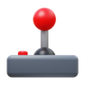

# MiniGames

Welcome to the **MiniGames** project! 🎮 This repository contains a collection of fun and engaging mini-games, perfect for passing the time or exploring simple game mechanics.

## Features

- 🕹️ **Interactive Games**: Includes popular games like Snake, Tic-Tac-Toe, Checkers, and more.
- 🧩 **Modular Design**: Each game is implemented as a standalone module.
- 🌐 **Web-Based**: Play directly in your browser with no installation required.
- ✨ **Customizable**: Easily extend or modify the games to suit your needs.

## Included Games

- 🐍 **Snake**
- ❌⭕ **Tic-Tac-Toe**
- 🐦 **Flappy Bird**
- 🐹 **Hamster Clicker**
- 🧠 **Memory Game**
- 🎨 **Coloring Page**
- ⚫⚪ **Checkers**
- 🎱 **Billiards**

## Project Structure

```
- app.js                # Main application logic
- package.json          # Project dependencies and metadata
- public/
  - images/
    - logo.png          # Project logo
  - js/
    - billiards.js      # Billiards game logic
    - checkers.js       # Checkers game logic
    - coloring-page.js  # Coloring page logic
    - flappy-bird.js    # Flappy Bird game logic
    - hamster-clicker.js# Hamster Clicker game logic
    - memory.js         # Memory game logic
    - script.js         # Shared script logic
    - snake.js          # Snake game logic
    - tic-tac-toe.js    # Tic-Tac-Toe game logic
  - styles/
    - styles.css        # Application styles
  - views/
    - main.html         # Main HTML file
```

## Getting Started

### Prerequisites

Ensure you have the following installed:

- [Node.js](https://nodejs.org/) (for dependency management)

### Installation

1. Clone this repository:
   ```bash
   git clone https://github.com/Karimov-Akbar/Mini-Games.git
   ```
2. Navigate to the project directory:
   ```bash
   cd MiniGames
   ```
3. Install dependencies:
   ```bash
   npm install
   ```

### Running the Project

1. Start the application:
   ```bash
   node app.js
   npm run dev
   ```
2. Open your browser and go to `http://localhost:10000` to start playing.

## Screenshots



## Contributing

Contributions are welcome! 🤝 Feel free to submit a pull request or open an issue to discuss new features or bug fixes.

## License

This project is licensed under the [MIT License](LICENSE).

---

Enjoy the MiniGames project and have fun playing! 🎉

